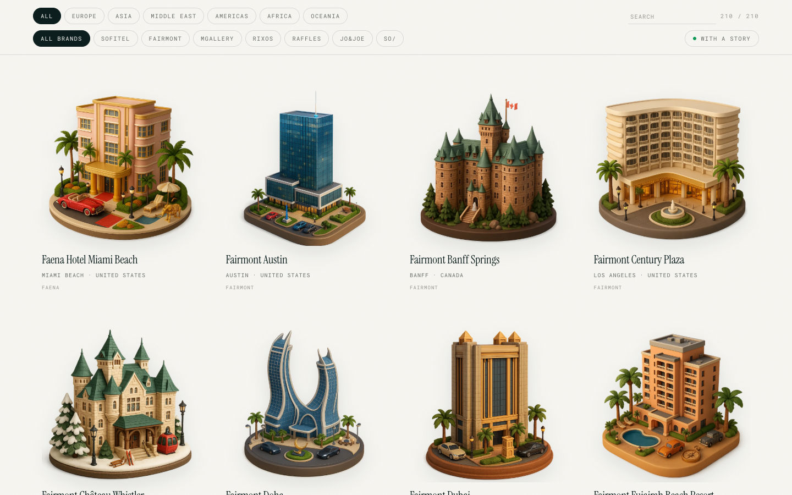
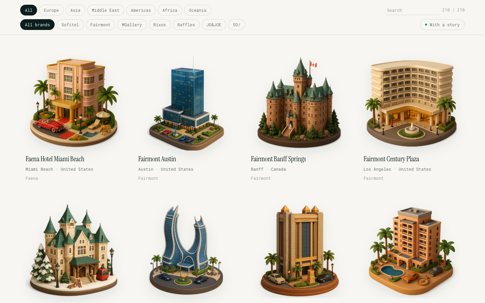
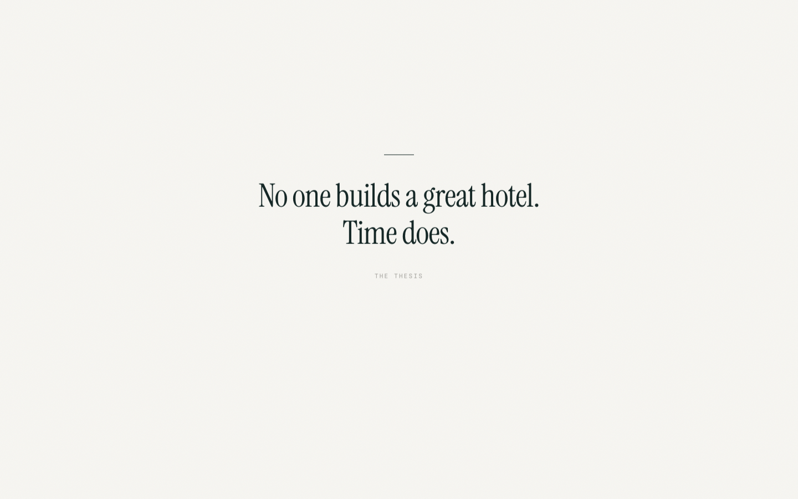
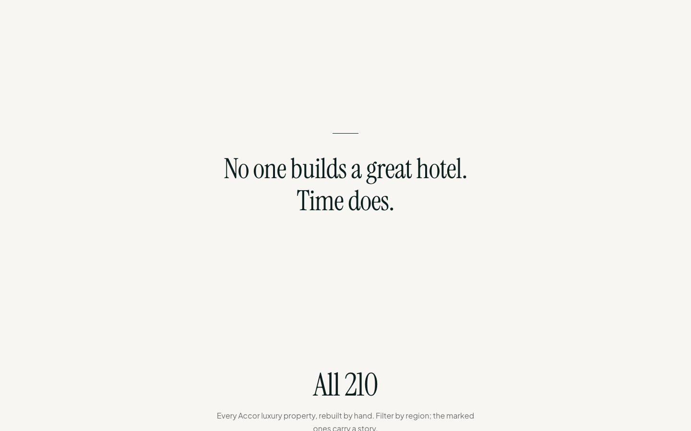

# Worked example: a live data page, audited and fixed

The subject is [sheets.works/accor](https://sheets.works/accor), a real shipped data piece: 210 hotels rebuilt as clay miniatures, with a scrollytelling opener and a filterable directory. It shipped before several of these tells were catalogued, which makes it an honest "before." The full skill workflow ran: scan → rendered-page review → triage → report → fix → re-verify.

## Scan, before

10 tell groups: eyebrow classes (A1 ×5), uppercase transforms (A2 ×16), italic-serif face (A4), glassmorphism (B5 ×2), a three-column grid (C2), observer scroll-reveals (D1 ×2), hover scale (D3), `transition: all` (D5 ×3), undersized text (F1 ×11), missing favicon (H4a).

## What the rendered page added

The screenshots caught what the grep can't rank: the directory was a wall of letterspaced mono caps (every filter chip, "SEARCH", "210 / 210", every card's location and brand line at 9–10px), the pull quote carried a "THE THESIS" caps-mono cite, the hero set its accent word in italic (tell A8, which the scanner doesn't see inside serif markup), and a grain overlay sat on warm paper under an italic-capable serif: the B2 stack, minus one ingredient.

| Before | After |
| --- | --- |
|  |  |
|  |  |
|  |  |

## Triage: fixed vs. defended

**Fixed.** The mono-caps system across ~16 selectors became the sanctioned voice: lowercase, tracking 0.02em, nothing under 12px. The uniform `.rv` fade-up reveal was deleted outright (the scrolly image switcher kept its observer: that one signals state). Card hover zoom deleted. `transition: all` ×3 became named properties. The grain overlay went (mobile had already disabled it for performance, which is a confession). The italic accent word went roman. "THE THESIS" was deleted; the quote stands alone. Dead `.eyebrow` and `.scrollcue` CSS (no markup used either) was removed. Favicon links added.

**Defended, pinned in source.** Instrument Serif: it is the page's committed display voice on every heading, card title, and drop cap, not a hero garnish, so it stays, set roman (`antislop-ignore A4`). Both backdrop blurs solve real layering (sticky filter bar, modal scrim). The card grid is the sole grid on the page and the 210-item catalog is the product (`antislop-ignore C2`).

## What the audit found beyond the catalog

Removing `text-transform: uppercase` exposed a data bug it had been masking: some source rows store cities in caps ("MIAMI BEACH") and others don't ("Los Angeles"). The page had been laundering inconsistent data through styling. Fixed with a render-time `tidy()`; the correct fix long-term is in the dataset. This is the recurring lesson of de-slopping: the defaults don't just look generated, they hide work that was never done.

## Scan, after

```
Scanned 1 files. No grep-detectable tells found.
```

Rendered-page re-review: chips and labels read as typeset; the hero holds without the italic; sections no longer fade in as you scroll; the clay miniatures (the page's native primitive, the thing that passes the reskin test) do all the work they were always doing, with less costume.
